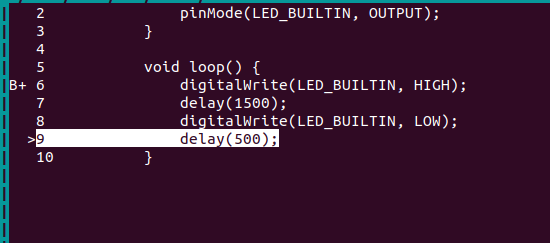
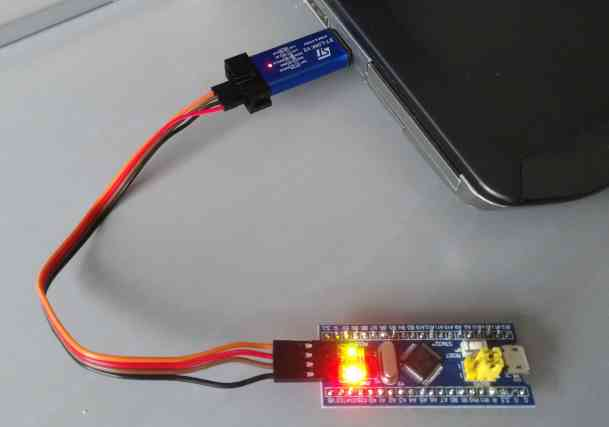
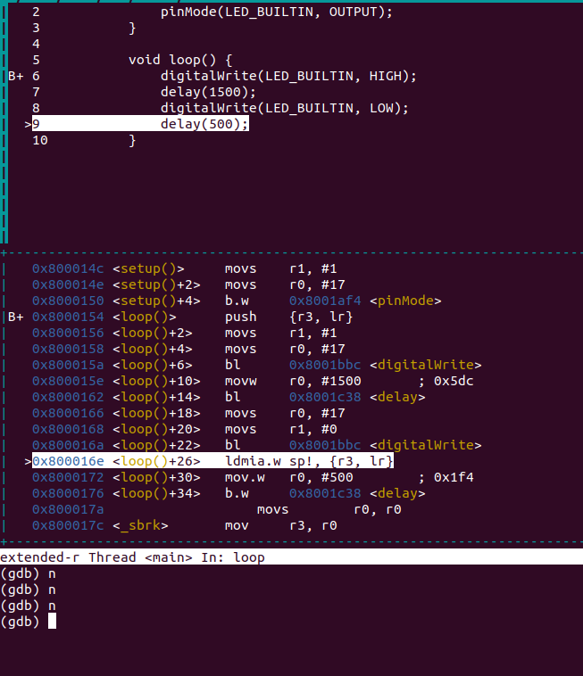

# on chip debugging an arduino sketch
(with a blue pill)

Have you ever wished you could step through your Arduino right on the device to
figure out why it isn't quite behaving as you had hoped? With some devices you
can!



This "document" covers:
- How I got `arduino-cli` working with an STM32
- How I conneted gdb to an STM32 with both `st-link-tools` or `openocd`

It's mainly just a bunch of stuff I wrote down for next time I need it, but it
might help somebody else too.

#### sources

I figured this out from reading these two books:


which uses [LibOpenCM3](https://libopencm3.org/) instead of arduino

and this rust microcontrollers online book called
[Discovery](https://docs.rust-embedded.org/discovery/f3discovery/)

But then I forgot everything, so this time I am writing it down on the internet
for safe keeping.

Neither of those books is about the Arduino platform, and for me, stepping
through an arduino sketch, where you can see the source code of the `.ino` file
makes it even cooler.

### hardware

I am using a microcontroller called an STM32F103C8T6 (nicknamed 'Blue Pill')



To program one you need another device called an ST-LINK. There are lots of
articles on how to get started with a blue pill and an ST-LINK, and how to hook
them together, just know that if your board looks anything like my picture, you
can use these instructions for setting up arduino debugging.

These instructions should be very similar for any STM32 board. Some boards,
like the one used in for rust development
[here](https://docs.rust-embedded.org/discovery/f3discovery/) have the ST-LINK
built right in. There are other ways to program and STM32 over serial, except
you won't be able to debug I don't think.

### software

#### stm32duino

To program the "Blue Pill" (or any other STM32) like an arduino, you need
[this](https://github.com/stm32duino). There are lots of tutorials on how to
install it in arduino IDE, but make sure you are using the _new_ board file:
https://github.com/stm32duino/BoardManagerFiles/raw/main/package_stmicroelectronics_index.json
All of the boards start with `STMicroelectronics`. The old ones started with
`STM32` I think.

This downloads the compiler and debugger for us as well.

#### arduino-cli

We need to pass in special compiler options, so we'll be using the
[arduino-cli](https://arduino.github.io/arduino-cli/0.19/installation/) instead
of the IDE. If you are used to the Arduino IDE, but not the CLI _and_ not the
STM32, then you might want to try one of these things before following these
instructions, so that you can like... triangulate.
- run 'Blink' on your normal Arduino Uno using `arduino-cli`
- run 'Blink' on an STM32 using the IDE.

There are a lot of tutorials for both. I'll start my instructions with
`arduino-cli` and the STM32.

#### talking to the board through the ST-LINK

There are at least two options for this:
- [openocd](https://openocd.org/)
- [stlink-tools](https://github.com/stlink-org/stlink)

They are both open source. `openocd` is in the rust discovery book, and
`stlink` is in the STM32 book. When I first tried to install `stlink` a few
years ago, it didn't work. I can't remember if my package manager had it, but
the STM32 book recommened just cloning the repo, but didn't tell me what hash,
and `master` at least didn't work. Then I upgraded to the next ubuntu version
and `apt` took care of everything.... so anyway.. it's good to have two options
in case one just stops working, so I'll include both. For all I know, one of
these could be a wrapper for the other.

stm32duino seems to use another option called
[STM32CubeProgrammer](https://www.st.com/en/development-tools/stm32cubeprog.html)
If you try to program the "Blue Pill" with the IDE you will be encouraged to
install it by an error message I think. I imagine that can do debugging too.
The executable is called STM32_Programmer.sh

The options I am using can be installed like this:

```
sudo apt-get install stlink-tools
```
I have package version 1.6.0+ds-1

or (or and)

```
sudo apt-get install openocd
```

I am using version 0.10.0

### development machine

If instead of Ubuntu, you are using some niche operating system, I'll assume
that's because you have a good reason, and therefore know what you are doing,
and how to translate command and package manager stuff to your environment.

### Other options

I think [platformio](https://platformio.org/) will set you up to debug right in
vscode.  It'll also help you quickly figure out all the client libraries
available, and maybe all the ones that can do on chip debugging.

They don't use use `.ino` files (last time I tried).  Instead they put the small
amount of boiler plate code right in your project.  It's like.. two lines
though, so don't worry.

Also, there is mythical device that only a few people claim to have ever seen
called an AVR Dragon, that I think can debug the processor on an Arduino Uno
(AVR).  I tried to order one, and I am not convinced they really exist, and
since I have never tried one, I don't know if they can debug stuff written in
the arduino platform.

While preparing this summary, I have discovered an arduino cli option
`arduino-cli debug` - I think that if you get an arduino zero, this is all
set up for you, but with an STM32 you get a message that this board doesn't
support it.  Maybe by the time you read this post, stm32duino will be updated
to allow it. I learned a lot by making it work though.

## Instructions

### set-up arduino-cli

There are a few things that didn't quite work as expected in the
[official instructions](https://arduino.github.io/arduino-cli/0.19/getting-started/),
and it doesn't cover STM32 directly, but by the time you read this, my
instructions will probably be out of date.. so you might have to bounce back and
forth.

but first [install](https://arduino.github.io/arduino-cli/0.19/installation/)

I can't figure out if this makes you re-install cores that are already installed
in the IDE. I got some messages that stuff was already installed some times,
and was surprised to have to install stuff I thought I already had other times.
I deleted and reinstalled my IDE, and I get the feeling the newest IDE version
interacts with the CLI differently from the old one I had.

So.. create a config file:

```
arduino-cli config init
```

This will output the name of the config file.  Mine is in
`~/.arduino15/arduino-cli.yaml`

Edit the file to add the same board description url that you might have used in
the IDE

```
...
board_manager:
  additional_urls:
    - https://github.com/stm32duino/BoardManagerFiles/raw/main/package_stmicroelectronics_index.json
daemon:
...
```

The template has some `[]` after `board manager:`, so I removed that and used
this hyphen format instead. If you already have a board in there, just add
another line with another hyphen.

Now install the stm32 'core' like this:

```
arduino-cli core install STMicroelectronics:stm32
```

and you might want to install the arduino uno core as well:

```
arduino-cli core install arduino:avr
```

I wasn't automatically installed for me. (at least not for cli). With this, if
you have an arduino uno or nano for example, and something in this section
doesnt' quite work, you can try something analogous with the default arduino
and possibly stumble into the solution, or at least 'bisect' the problem.

Create a project directory. If you are already using the IDE, you can just
open the `Blink` template there, and then save-as, and you will have the
directory with the `ino` file inside. Or you can just do it like this:

```
$ mkdir Blink
$ cd Blink
$ cat > Blink.ino
void setup() {
    pinMode(LED_BUILTIN, OUTPUT);
}

void loop() {
    digitalWrite(LED_BUILTIN, HIGH);
    delay(1000);
    digitalWrite(LED_BUILTIN, LOW);
    delay(1000);
}
```
(copied from here: https://arduino.github.io/arduino-cli/0.19/getting-started/)

I know it's a bit inconsistent. I didn't put `$` in front of any other
terminal commands, but in this case I had to separate the commands from the
file input thing. If you don't know what that means, don't worry. Just create
a directory called `Blink` and then create a file in it called `Blink.ino`
and then put that blink program inside the file.

##### Compile

Now compile the non debug version like this

```
arduino-cli compile --fqbn STMicroelectronics:stm32:GenF1 -e
```

The `-e` means `--export-binaries` which puts all the binary files that you
need into a directory in the project. If you don't put that, they are hidden
somewhere where other arduino commands know where to look, but we don't.

It seems you don't need to tell it the entry point.  I don't know if it looks
for any `.ino` or looks for one with the same name as the directory you are in.

output should look like this
```
$ arduino-cli compile --fqbn STMicroelectronics:stm32:GenF1 -e
Sketch uses 10880 bytes (33%) of program storage space. Maximum is 32768 bytes.
Global variables use 804 bytes (7%) of dynamic memory, leaving 9436 bytes for local variables. Maximum is 10240 bytes.
```

and you should now have the compiled program in your project directory:
```
$ find .
./build
./build/STMicroelectronics.stm32.GenF1
./build/STMicroelectronics.stm32.GenF1/Blink.ino.map
./build/STMicroelectronics.stm32.GenF1/Blink.ino.elf
./build/STMicroelectronics.stm32.GenF1/Blink.ino.bin
./build/STMicroelectronics.stm32.GenF1/Blink.ino.hex
./Blink.ino
```
##### Connect Board

Now is a good time to tell you to wire up and plug in your "Blue Pill". There
are instructions are the "internet", and I have nothing new to add. However,
when you are done, it should look something like this:


I have already soldered the pins on. However, you don't actually need to do
that to follow these instructions. We are only using the built in LED.

I have plugged in my arduino uno as well to show what the board list should
look like.

```
$ arduino-cli board list
Port         Protocol Type              Board Name  FQBN            Core       
/dev/ttyACM0 serial   Serial Port (USB) Arduino Uno arduino:avr:uno arduino:avr
```

The arduino uno shows up, but the ST-Link doesn't. That's OK.  The upload tool
still finds it.

If you have st-link-tools, this will show that it is connected

```
$ st-info --probe # to make sure it is connected
Found 1 stlink programmers
 serial: 3833050232123853354b4e00
openocd: "\x38\x33\x05\x02\x32\x12\x38\x53\x35\x4b\x4e\x00"
  flash: 131072 (pagesize: 1024)
   sram: 20480
 chipid: 0x0410
  descr: F1 Medium-density device
```
You can see above that it says `openocd` before that number. That is the name
of the other tool. I wonder what it means.

If you are planning on using `openocd` instead of `st-link-tools`, then I
don't know how to probe the board, but don't worry; we'll soon find out if it
is connected.

##### Flash it with arduino-cli

They might have fixed it, or somebody else might have a better workaround, but
when I try to upload, I get this:

```
$ arduino-cli upload -p /dev/ttyS0 --fqbn STMicroelectronics:stm32:GenF1
Error during Upload: Property 'upload.tool.serial' is undefined
```

and then a quick duckduckgo search takes me to
[this issue](https://github.com/arduino/arduino-cli/issues/1444)

There are probably ways to fix it using local configuration files, and I guess
the board library will eventually be updated, but I just upload the binary
using either of the st-link tools that I have mentioned:

##### Flash it with stlink-tools

So first stlink-tools - the installation instructions for ubuntu are above.

Now erase. A few times flashing the program failed, and then I fixed it by
erasing first. So now I just erase all the time:

```
$ st-flash erase
st-flash 1.6.0
2022-01-13T10:03:18 INFO common.c: Loading device parameters....
2022-01-13T10:03:18 INFO common.c: Device connected is: F1 Medium-density device, id 0x20036410
2022-01-13T10:03:18 INFO common.c: SRAM size: 0x5000 bytes (20 KiB), Flash: 0x20000 bytes (128 KiB) in pages of 1024 bytes
Mass erasing
```

Now flash the program:

```
$ st-flash write build/STMicroelectronics.stm32.GenF1/Blink.ino.bin 0x8000000
st-flash 1.6.0
2022-01-13T19:08:57 INFO usb.c: -- exit_dfu_mode
2022-01-13T19:08:57 INFO common.c: Loading device parameters....
2022-01-13T19:08:57 INFO common.c: Device connected is: F1 Medium-density device, id 0x20036410
2022-01-13T19:08:57 INFO common.c: SRAM size: 0x5000 bytes (20 KiB), Flash: 0x20000 bytes (128 KiB) in pages of 1024 bytes
2022-01-13T19:08:57 INFO common.c: Attempting to write 11172 (0x2ba4) bytes to stm32 address: 134217728 (0x8000000)
Flash page at addr: 0x08002800 erased
2022-01-13T19:08:57 INFO common.c: Finished erasing 11 pages of 1024 (0x400) bytes
2022-01-13T19:08:57 INFO common.c: Starting Flash write for VL/F0/F3/F1_XL core id
2022-01-13T19:08:57 INFO flash_loader.c: Successfully loaded flash loader in sram
 11/11 pages written
2022-01-13T19:08:58 INFO common.c: Starting verification of write complete
2022-01-13T19:08:58 INFO common.c: Flash written and verified! jolly good!
```

and now my "Blue Pill" is blinking, and hopefully yours is too.

##### Flash it with openocd

It sounds like there is a way to flash outside the debugger using openocd
https://openocd.org/doc-release/html/Flash-Commands.html#Flash-Commands

However, I have tried this, and it doesn't like it:

```
$ openocd -f interface/stlink-v2.cfg -f target/stm32f1x.cfg -c "flash program build/STMicroelectronics.stm32.GenF1/Blink.ino.bin"
Open On-Chip Debugger 0.10.0
Licensed under GNU GPL v2
For bug reports, read
        http://openocd.org/doc/doxygen/bugs.html
Info : auto-selecting first available session transport "hla_swd". To override use 'transport select <transport>'.
Info : The selected transport took over low-level target control. The results might differ compared to plain JTAG/SWD
adapter speed: 1000 kHz
adapter_nsrst_delay: 100
none separate
invalid subcommand "program build/STMicroelectronics.stm32.GenF1/Blink.ino.bin"
in procedure 'flash'
```

So instead, if you have chosen openocd, either wait until the debug section, or
just use the same flasher program that stm32duino uses for the non debug
part:

##### Flash it with STM32_Programmer.sh / stm32CubeProg.sh

When you install stm32duino, it puts a bunch of programs in `~/.arduino15/`
We'll be using that later to get something from the arm gcc tool chain.

In there, they have a wrapper script called stm32CubeProg.sh

I successfully used it to flash my program onto my microcontroller like this:

```
bash ~/.arduino15/packages/STMicroelectronics/tools/STM32Tools/2.1.1/stm32CubeProg.sh \
    0 build/STMicroelectronics.stm32.GenF1/Blink.ino.bin
```

(adjust the path for your version)
(If you don't have the tool it relies on, it should give you the url in an
error message)

If you look inside the script, `0` means SWD, which is the option you choose in
the IDE for the st-link programmer.

One thing that is a little bit different about this tool is that after you
upload, you won't see it blinking until you press the reset button on the board
or disconnect it from your computer, and then plug it back in. That had me
confused.

Another option is to skip the wrapper in the stm32duino package, and just call
the program that it calls.  If you have it installed (by running the above, and
reading the error message, and following the instructions), you can do this:

```
STM32_Programmer.sh -c port=SWD mode=UR -d build/STMicroelectronics.stm32.GenF1/Blink.ino.bin 0x8000000
```

The wrapper script actually also passes in a `-q` option for quiet.  However,
since you are folloing a "tutorial" on the "internet", that is probably old,
there is a good chance that it is not going to work as expected, so better to
print out some debug info if there is some.

### Debug!!

OK now that we know how to just ordinary compile on the command line and deploy
we are ready to debug

##### Compile debug version

First we have to compile with all the debug info:

```
arduino-cli compile --fqbn STMicroelectronics:stm32:GenF1 -e \
    --build-property compiler.c.extra_flags=-g \
    --build-property compiler.c.elf.extra_flags=-g \
    --build-property compiler.cpp.extra_flags=-g
```

I can't tell you for sure if all of the `-g` options are needed. I found this
in an old project. Inside the stm32duino package, if you look at this file
you might be able to figure out better options

~/.arduino15/packages/STMicroelectronics/hardware/stm32/2.2.0/platform.txt

That file contains this line
```
compiler.c.extra_flags={build.peripheral_pins}
```

Which I think means that if you try to set `build.peripheral_pins` it won't
behave as expected, because you will override the part where your
`build.peripheral_pins` gets written to `compile.c.extra_flags`. So if you
are doing anything fancy, you might need to get to know the options a bit better
than I have.

Also, it says you can override this stuff by creating a file called
`platform.local.txt`. I haven't tried since I just put all the options I need
in a `makefile`.

Now, if that succeeds, it will replace what is in the builds directory with
a debuggable version. When I want to be sure that it worked, I usually delete
the build directory before compiling again.

##### erase it

When I try with the st-util, I delete the non debug version before trying to
connect and reflash with the debugger:

```
st-flash erase
```

with openocd I didn't have that problem

##### start the debug server


In one tab, you can start a server that connects to your like this

```
st-util
```

or, if you wanna use `openocd` instead, so like this:


```
openocd -f interface/stlink-v2.cfg -f target/stm32f1x.cfg
```

You might have to change `v2` to `v2.1` depending what kind of programmer you
have and if you are using a different board, you have to change that too. There
are some lists

https://github.com/arduino/OpenOCD/tree/master/tcl/target
https://github.com/arduino/OpenOCD/tree/master/tcl/interface

I figured it out thanks to [this](https://www.openstm32.org/forumthread562)
since I am not using the same board here as the rust book.

##### debug!

In another tab, you have to open a special `gdb` from the arm toolchain. When
I did this without Arduino, I had to follow some instructions and download
the arm toolchain from a website.. like with my browser, and clicking menus,
and the menus weren't really the same as the tutorial I was following so it was
hard to find.  Anyway we don't have to do that here, because stm32duino bundles
the arm toolchain for you! You should be able to find it in your arduino
directory somewhere like this:

```
~/.arduino15/packages/STMicroelectronics/tools/xpack-arm-none-eabi-gcc/10.3.1-2.3/bin/arm-none-eabi-gdb
```

I hope that nobody is using this as a way to put malware onto all our laptops,
or worse, into our microcontrollers.. like imagine if they modified the compiler
to somehow mine bitcoin during every sleep. But if you are using stm32duino,
you are using this arm toolchain, so hopefully we can trust it without
completely understanding where it comes from.

So if you run the command above, the debugger will start.

Then put these commands into gdb.

(If you are using openocd, change the port to :3333)

```
(gdb) target extended-remote :4242
(gdb) file build/STMicroelectronics.stm32.GenF1/Blink.ino.elf
(gdb) load build/STMicroelectronics.stm32.GenF1/Blink.ino.elf
```
and basically, if it asks you if you are sure about anything say yes

and then if the last command works you should get an output like this

```
(gdb) load build/STMicroelectronics.stm32.GenF1/Blink.ino.elf
Loading section .isr_vector, size 0x10c lma 0x8000000
Loading section .text, size 0x2444 lma 0x800010c
Loading section .rodata, size 0x5b8 lma 0x8002550
Loading section .init_array, size 0x10 lma 0x8002b08
Loading section .fini_array, size 0x8 lma 0x8002b18
Loading section .data, size 0x84 lma 0x8002b20
Start address 0x08001aa8, load size 11172
Transfer rate: 15 KB/sec, 1862 bytes/write.
```

Then set the breakpoint

```
(gdb) b loop
```

Most guides will tell you `main` but here we need `loop`. (or `setup`)

and then continue, since it is now paused at the start

```
(gdb) c
```

and you should see something like this

```
6           digitalWrite(LED_BUILTIN, HIGH);
```

and now the really exciting part

```
(gdb) layout split
```



You can now press `n` to run one command, and you should be able to make the
LED turn on an off.  You will notice that `LOW` is on and `HIGH` is off.

And now you can follow one of the many gdb guides on the internet to find out
what other cool things you can do.
[This](https://docs.rust-embedded.org/discovery/f3discovery/appendix/2-how-to-use-gdb/index.html)
is pretty good. It's for rust and STM32, but there are lots just for ordinary
C executables running on your own computer that should mostly be applicable
to this as well.

I think you can also use most of this set-up to debug with vscode. Just search
for how to debug with gdb and vscode.

