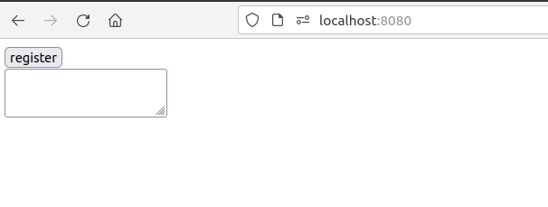
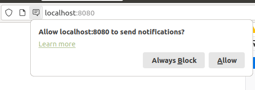
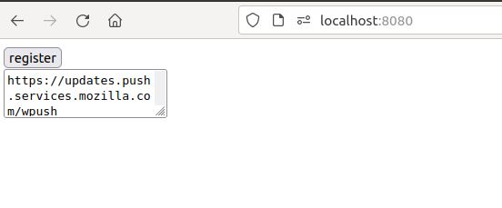
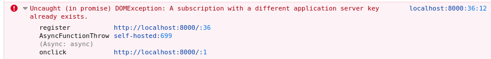
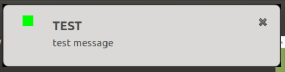

# Send yourself a browser push notification in like five minutes

Every time I do something with push notifications, I have to remind myself how
they work, and to do that I send myself a push notification.  There are a lot
of great examples on the web, but they handle a lot of "ifs, ands, and buts",
and I find that when I have taken in the minimal happy path first, I have
something compare all the bigger examples to, and a way to understand the
selling points of any library that makes it easier or better. If a more
complicated example doesn't work, but you have seen the simple thing work, you
can like "triangulate" and "bisect" your way to success to sometimes.

Remembering how to do this took me a little longer than I would have liked, so
this time I wrote it down, so that next time I only take five mintues.

[this article](https://commoncog.com/blog/tacit-knowledge-is-a-real-thing/) I
saw on hackernews a few weeks ago has an interesting part about learning how to
ride a bike, and
[this one](https://www.scotthyoung.com/blog/2022/01/04/cognitive-load-theory/)
from, also from hackernews today, also feels related.

### Who is this for?

My target audience is me one year from now, but anybody similar to that might
find this useful too. You will probably have trouble following this if you don't
have a basic understanding of javascript, html, bash, node, how they fit
together, and how to run a local webserver.

This demo just goes through registering on a local website, and then
sending yourself a message on the command line. It doesn't handle any of the
many exceptions, or how to handle unsubscribe, or even how to handle "subscribe"
or sending the right messages to the right users, or the most up to date way of
doing it, or even how to add a payload to the message. There is also something
called 'vapid keys' that you are meant to use, but again, I'm hoping to make
more sense of vapid keys after seeing it work once without.

So if you are looking for production ready best practices, this is not for you.

#### note about dependencies and security

I wrote my first draft of this post using the npm packages
[web-push](https://www.npmjs.com/package/web-push) and
[http-server](https://www.npmjs.com/package/http-server)

`web-push` was because that is how I originally learned this years ago from
this fantastic book:


`http-server` because I didn't want to make this harder to follow by doing
what I usually do when I need a local server, `python3 -m http.server`, and
add another language and ecosystem to simple post.

When I was about to `git push`, I realised that... I don't want to recommend
that you download third party executables that have access to the internet and
all the files in your home directory, and basically circumvent your distro's
package manager - I am not qualified to do that. And if you judge the safey of a
package by the number of posts that are telling you to use it, I don't want to
create one of those posts, because it'll only be based on other posts that I
have read.

I could also just say something in the post how it is _your_ responsible to
personally review all the packages you install, but then what use would my post
be?

So instead, I have made an _even simpler_ example using `curl`, and as far as
the webserver, just decided that my taret audience (based on me in future)
knows how to start a local server.

## Instructions

First create a "project directory" and go into it

```
$ mkdir push-noticiation-example
$ cd push-notification-example
```

##### website

To register for push notifications, we need to visit a website.  But the nice
thing is that the website doesn't need to be accessible "ever again" after
registering.

Create a directory for the website like this:

```
mkdir web
```

The website I "have in mind" has three files:
- [index.html](./web/index.html)
- [service-worker.js](./web/service-worker.js)
- favicon.ico

`index.html` and `service-worker.js` can be copied from the ones I have
linked to.  You an clone this repo if you want, but it's just two files so I
would just copy the files, or open them up and type what is in them.

I have made the two files as simple as possible, and have replaced the error
handling you see in most examples with just... errors.  I have written them
more to be read then to be copy/pasted.

The [html file](./web/index.html) is mainly javascript. It registers the
service worker and saves it in a global variable. That's not the best way to do
it for real probably, but that's not what this post is about. It also uses trick
I learned from these templates I saw a few times in angular-1 - putting html
we are gonna need later into a script tag. I guess the pros just have two divs
and hide one and show the other. You might want to do it that way if doing it
my way is confusing your editor.

The [service worker](./web/service-worker.js) file is registered by the html
file, and tells your browser what to do when a push notification is received -
in this case, display a message that says 'TEST: test messsage'. This could also
tell it to refresh, and I believe can behave differently depending on how stuff
like whether you have the page open or whether you are looking at it.

I would read these files briefly now, and then read them over again when it
all works, or read them throroughly.

`favicon.ico` can be generated with imagemagick like this:

```
convert -size 16x16 xc:#00FF00 web/favicon.ico
```

but if you don't have imagemagick or know what it is, then figuring that out
right now could really blow our five minute budget, so just use one of those
favicon generator sites or something, and save it to `web/favicon.ico`. Just
make a `favicon.ico` how _you_ usually make them.

I am using a green square, because when the "test message" works it makes me
think of a "green test".

##### start the site

Now start a local development webserver that serves the `web` directory on port
8080, or choose a different port, and adjust the address you see in the next
section.

##### visit the site and register

Go to http://localhost:8080 in your browser, and should see this:



If you can see the form, it means the service worker successfully registered.
If you can't, there was an error registering the service worker.

You will be asked to confirm that you want push notifications from this site.



This should generate a URL and put it in the box.



Now copy the url it gives you back. This address can be used by anyhow to send
you a message in this browser. Because of the code in the service worker, the
message will always be "TEST: test message", so maybe you can use it as some
kind of bat signal - where "TEST: test message" means... "make another pot of
coffee" or something.

##### toubleshooting

If you have already used this local server port for an experiment like this,
you might get an error similar to this one:



In that case, you can just _unregister_ you service worker, and then reload
the page.  If you have never worked with service workers before, just ask
duckduckgo how to "unregister serviceworker" - it'll show you the "application
tab".

##### send message

You can now stop your local webserver.  You are registered.

Run this `curl` command, but replace my personal url with the one you just got.
I have truncated my url, so yours will be much longer. I considered publishing
a real working url, so that anybody who read this could say hi, but since my
service worker doesn't look at the payload, no point really.

```
curl https://updates.push.services.mozilla.com/wpush/v1/gAAAAABh5O1- \
    -v --request POST --header "TTL: 60" --header "Content-Length: 0"
```
(thanks
https://developers.google.com/web/ilt/pwa/introduction-to-push-notifications)

When I run the above command, I get this



I hope you do too.

##### Next steps

So that concludes the five minute demo.

Now that I have reminded myself how the system works, I can read examples and
take them in.  Here is what I have to do for the real thing:
* read most of [this](https://developer.mozilla.org/en-US/docs/Web/API/Push_API)
* find a push notification library for the server side language that I am using.
It will be much easier to understand what the library can do for me now that I
have seen what I can do with just curl.
* add a payload to the message (because now they are all the same)
* make the webpage behave different if you have it open or closed
(when you have the webpage open, sometimes you don't need to see the message,
just trigger a refresh)
* find out what 'vapid-keys' are about. That will be much easier to understand
now that I know what you can do without them.
